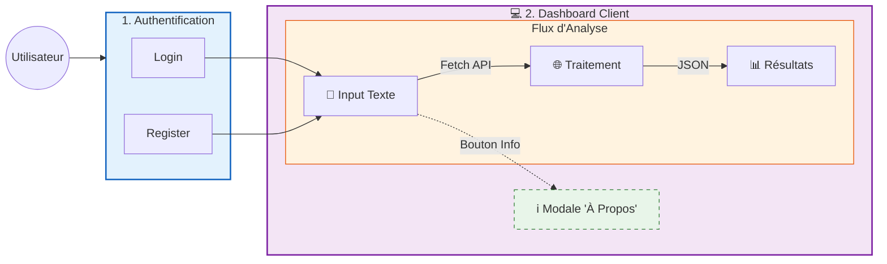
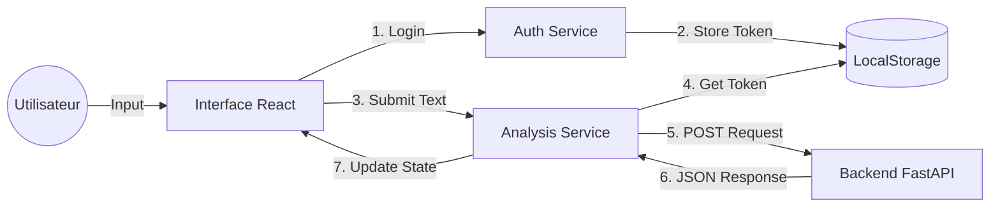

# Hybrid-Analyzer Client (Frontend)


## À propos
Ce repository contient l'interface utilisateur (Frontend) du projet Hybrid-Analyzer. Développée en React.js, elle offre une interface fluide et responsive permettant aux utilisateurs de s'authentifier et d'interagir avec l'API d'analyse de veille média.
L'application gère le cycle de vie complet de l'analyse : de la saisie du texte brut à l'affichage des résultats générés par l'IA (Classification Hugging Face + Synthèse Gemini).

## Fonctionnalités de l'application :



## Stack Technologique
Framework : React.js (Hooks, JSX)
Routing : React Router DOM (Navigation /auth, /analyze)
Client HTTP : Fetch (Intercepteurs pour injecter le Token)
Styling : CSS Modules / Styled-Components (ou Tailwind selon votre implémentation)
Build Tool : Webpack / Vite

##  Architecture & Flux
L'application suit une structure basée sur les composants et communique avec l'API via des requêtes asynchrones.


## Installation et Lancement
1. Prérequis
  - Node.js (v16+) et npm installés.
  - Le Backend (FastAPI) doit être lancé (par défaut sur http://localhost:8000).
2.  Lancer le projet avec Docker
 - Ouvrez votre terminal à la racine du projet.
 - Lancez la construction et le démarrage :
 ```bash
 docker-compose up --build
 ```
 3. Accédez à l'application :
      - Frontend : http://localhost:5173
      - Backend Swagger : http://localhost:8000/docs
 4. Connexion à la base PostgreSQL dans Docker : 
   - Accéder au container PostgreSQL :
```bash
   docker-compose exec db psql -U postgres -d Orchestration_db
```
  - Lister les tables existantes :
```bash
   \dt
```
 - Afficher le contenu de la table Users :
```bash
   SELECT * FROM public."Users";
```
- Afficher le contenu de la table analysis_logs :
```bash
   SELECT * FROM public."analysis_logs";
```

## Gestion des Erreurs Frontend
L'interface gère les codes erreurs renvoyés par le backend :
```bash
| Code | Incident (Cause) | Action / Message |
|------|------------------|------------------|
| **401** | Session expirée / non authentifié | Redirection vers `/auth` |
| **422** | Texte vide ou invalide | Alerte : "Texte invalide" |
| **500** | Erreur interne serveur | "Service indisponible, réessayez" |
| **503** | Serveur en surcharge / maintenance | "Service temporairement indisponible" |
```


