# Hybrid-Analyzer Client (Frontend)


## À propos
Ce repository contient l'interface utilisateur (Frontend) du projet Hybrid-Analyzer. Développée en React.js, elle offre une interface fluide et responsive permettant aux utilisateurs de s'authentifier et d'interagir avec l'API d'analyse de veille média.
L'application gère le cycle de vie complet de l'analyse : de la saisie du texte brut à l'affichage des résultats générés par l'IA (Classification Hugging Face + Synthèse Gemini).

## 1. Fonctionnalités de l'application :

```mermaid 
---
config:
  theme: dark
---
flowchart LR
 subgraph Auth_Zone["1. Authentification"]
    direction TB
        Login["Login"]
        Reg["Register"]
  end
 subgraph Work_Flow["Flux d'Analyse"]
    direction LR
        API["🌐 Traitement"]
        Input["📝 Input Texte"]
        Result["📊 Résultats"]
  end
 subgraph Dash_Zone["💻 2. Dashboard Client"]
    direction BT
        Work_Flow
        Info@{ label: "ℹ️ Modale 'À Propos'" }
  end
    Input -- Fetch API --> API
    API -- JSON --> Result
    User(("Utilisateur")) --> Auth_Zone
    Login --> Input
    Reg --> Input
    Input -. Bouton Info .-> Info

    Info@{ shape: rect}
    style Work_Flow fill:#fff3e0,stroke:#e65100
    style Info fill:#e8f5e9,stroke:#2e7d32,stroke-dasharray: 5 5,color:#000000
    style Auth_Zone fill:#e3f2fd,stroke:#1565c0,stroke-width:2px,color:#000000
    style Dash_Zone fill:#FFCDD2,stroke:#7b1fa2,stroke-width:2px,color:#000000
```



## 2. Architecture & Flux
L'application suit une structure basée sur les composants et communique avec l'API via des requêtes asynchrones.


## 3. Stack Technologique
- Framework : React.js (Hooks, JSX)
- Routing : React Router DOM (Navigation /auth, /analyze)
- Client HTTP : Fetch 
- Styling : CSS Modules 
- Build Tool :  React ,Vite

## 4. Installation et Lancement :
### 1. Prérequis
  - Node.js (v16+) .
  - Le Backend (FastAPI) doit être lancé (par défaut sur http://localhost:8000).
  - Clonez le dépôt
    ```sh
      git clone https://github.com/khadija199904/Secure_Translate_Platform_Frontend
      ```
  - Installez les dépendances NPM
    ```sh
    npm install
    ```
### 2.  Lancer le projet avec Docker
 - Ouvrez votre terminal à la racine du projet.
 - Lancez la construction et le démarrage :
 ```bash
 docker-compose up --build
 ```
### 3. Accédez à l'application :
      - Frontend : http://localhost:5173
      - Backend Swagger : http://localhost:8000/docs
### 4. Connexion à la base PostgreSQL dans Docker : 
   - Accéder au container PostgreSQL :
```bash
   docker-compose exec db psql -U postgres -d Orchestration_db
```
  - Lister les tables existantes :
```bash
   \dt
```
 - Afficher le contenu de la table Users :
```bash
   SELECT * FROM public."Users";
```
- Afficher le contenu de la table analysis_logs :
```bash
   SELECT * FROM public."analysis_logs";
```

## 5. Gestion des Erreurs Frontend
L'interface gère les codes erreurs renvoyés par le backend :
```bash
  Code   Signification
  ------ -----------------------
  401    Non authentifié
  422    Texte vide ou invalide
  500    Erreur interne serveur
  503    Serveur en surcharge
```
  


## 6. Structure du projet (Frontend)

```bash

Plateforme_Orchestration_IA_Frontend/
│
├── docker-compose.yml            # Orchestration des services (Frontend + Backend + BD)
│
├── my-react-app/                 #  PARTIE FRONTEND (React + Vite)
│   ├── node_modules/             # Dépendances (exclues par .gitignore/.dockerignore)
│   │
│   ├── src/                      # Code source de l'application
│   │   ├── App.jsx               # Composant principal + routing
│   │   ├── App.css
│   │   ├── index.css
│   │   ├── main.jsx              # Point d’entrée Vite
│   │   │
│   │   ├── components/           # Composants UI réutilisables
│   │   │   ├── About.jsx         # Pop-up d'information
│   │   │   ├── About.css
│   │   │   ├── LogoutButton.jsx  # Gestion de la déconnexion
│   │   │   ├── login.jsx         # Composant Login
│   │   │   └── register.jsx      # Composant Register
│   │   │
│   │   └── pages/                # Pages complètes
│   │       ├── analyze/          # Page d’analyse IA
│   │       │   ├── analyse.jsx
│   │       │   └── analyse.css
│   │       │
│   │       └── auth/             # Pages d’authentification
│   │           ├── auth.jsx
│   │           └── auth.css
│   │
│   ├── Dockerfile                # Image Docker du frontend
│   ├── .dockerignore             # Exclusions Docker
│   ├── index.html
│   ├── package.json              # Dépendances + scripts npm
│   ├── package-lock.json
│   └── vite.config.js            # Configuration Vite
│
├── Readme.md                     # Documentation du projet
└── .gitignore                    # Fichiers ignorés par Git

```


## Auteur

**Nom :** KHADIJA ELABBIOUI  
**Email :** khadija.elabbioui1999@gmail.com  
**LinkedIn :** [linkedin.com/in/khadija-elabbioui](https://www.linkedin.com/in/khadija-elabbioui-308499216/)  
**GitHub :** [github.com/ton-github](https://github.com/khadija199904)


